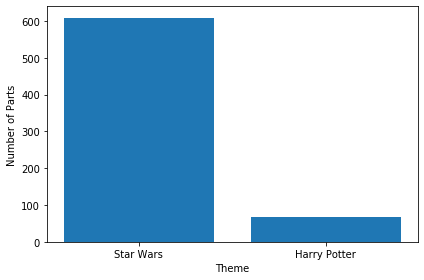

## Explore the world of Lego
<p></p>
<h3 id="letslookatlegosets">Let's look at Lego sets!</h3>
<p>Lego is a household name across the world, supported by a diverse toy line, hit movies, and a series of successful video games. In this project, we are going to explore a key development in the history of Lego: the introduction of licensed sets such as Star Wars, Super Heroes, and Harry Potter.</p>
<p>It may not be widely known, but Lego has had its share of ups and downs since its inception in the early 20th century. This includes a particularly rough period in the late 90s. As described in <a href="https://www.businessinsider.com/how-lego-made-a-huge-turnaround-2014-2?r=US&IR=T">this article</a>, Lego was only able to survive due to a successful internal brand (Bionicle) and the introduction of its first licensed series: Star Wars. In the instructions panel are the two questions you will need to answer to complete this project.</p>
<p>Before diving into our analysis though, let's become familiar with the two datasets that will help you with this project:<br><br></p>
<div style="background-color: #ebf4f7; color: #595959; text-align:left; vertical-align: middle; padding: 15px 25px 15px 25px; line-height: 1.6;">
    <div style="font-size:20px"><b>datasets/lego_sets.csv</b></div>
<ul>
    <li><b>set_num:</b> A code that is unique to each set in the dataset. <b><i>This column is critical, and a missing value indicates the set is a duplicate or invalid!</i></b></li>
    <li><b>set_name:</b> A name for every set in the dataset (note that this can be the same for different sets).</li>
    <li><b>year:</b> The date the set was released.</li>
    <li><b>num_parts:</b> The number of parts contained in the set.<b><i> This column is not central to our analyses, so missing values are acceptable.</i></b></li>
        <li><b>theme_name:</b> The name of the sub-theme of the set.</li>
    <li><b>parent_theme:</b> The name of the parent theme the set belongs to. Matches the `name` column of the `parent_themes` csv file.</li>
</ul>

<div style="font-size:20px"><b>datasets/parent_themes.csv</b></div>
<ul>
    <li><b>id:</b> A code that is unique to every theme.</li>
    <li><b>name:</b> The name of the parent theme.</li>
    <li><b>is_licensed:</b> A Boolean column specifying whether the theme is a licensed theme.</li>
</ul>
    </div>
<p>From here on out, it will be your task to explore and manipulate the existing data until you are able to answer the two questions described in the instructions panel. Feel free to add as many cells as necessary. Finally, remember that you are only tested on your answer, not on the methods you use to arrive at the answer!</p>
<p><em><strong>Note:</strong> If you haven't completed a DataCamp project before you should check out the <a href="https://projects.datacamp.com/projects/33">Intro to Projects</a> first to learn about the interface. In this project, you also need to know your way around <code>pandas</code> DataFrames and it's recommended that you take a look at the course <a href="https://www.datacamp.com/courses/data-manipulation-with-pandas">Data Manipulation with pandas</a>.</em></p>


```python

# Start with total number of licensed sets 

import pandas as pd

df = pd.read_csv('datasets/lego_sets.csv')

themes = pd.read_csv('datasets/parent_themes.csv')
```


```python
import matplotlib as plt
```

# Data Cleaning and Preparation


```python
# Let's join/merge the datasets first using merge().

# Merge on parent theme from the df and name from the themes table.
merged_df = df.merge(themes, left_on = 'parent_theme', right_on = 'name')
```

```python
merged_df.head()
```


<div>
    
<table border="1" class="dataframe">
  <thead>
    <tr style="text-align: right;">
      <th></th>
      <th>set_num</th>
      <th>name_x</th>
      <th>year</th>
      <th>num_parts</th>
      <th>theme_name</th>
      <th>parent_theme</th>
      <th>id</th>
      <th>name_y</th>
      <th>is_licensed</th>
    </tr>
  </thead>
  <tbody>
    <tr>
      <th>0</th>
      <td>00-1</td>
      <td>Weetabix Castle</td>
      <td>1970</td>
      <td>471.0</td>
      <td>Castle</td>
      <td>Legoland</td>
      <td>411</td>
      <td>Legoland</td>
      <td>False</td>
    </tr>
    <tr>
      <th>1</th>
      <td>00-2</td>
      <td>Weetabix Promotional House 1</td>
      <td>1976</td>
      <td>NaN</td>
      <td>Building</td>
      <td>Legoland</td>
      <td>411</td>
      <td>Legoland</td>
      <td>False</td>
    </tr>
    <tr>
      <th>2</th>
      <td>00-3</td>
      <td>Weetabix Promotional House 2</td>
      <td>1976</td>
      <td>NaN</td>
      <td>Building</td>
      <td>Legoland</td>
      <td>411</td>
      <td>Legoland</td>
      <td>False</td>
    </tr>
    <tr>
      <th>3</th>
      <td>00-4</td>
      <td>Weetabix Promotional Windmill</td>
      <td>1976</td>
      <td>126.0</td>
      <td>Building</td>
      <td>Legoland</td>
      <td>411</td>
      <td>Legoland</td>
      <td>False</td>
    </tr>
    <tr>
      <th>4</th>
      <td>00-7</td>
      <td>Weetabix Promotional Lego Village</td>
      <td>1976</td>
      <td>NaN</td>
      <td>Building</td>
      <td>Legoland</td>
      <td>411</td>
      <td>Legoland</td>
      <td>False</td>
    </tr>
  </tbody>
</table>
</div>


```python
# Due to the merge there is a duplicate column. Let's get rid of it.
merged_df.drop(columns='name_y', inplace=True)
```


```python
# Inspect NA values for each column
merged_df.isna().sum()

```


    set_num          153
    name_x           153
    year               0
    num_parts       5060
    theme_name       153
    parent_theme       0
    id                 0
    is_licensed        0
    dtype: int64


```python
# Drop rows of set_num that contain NA values 
merged_clean = merged_df.dropna(subset=['set_num'])
merged_clean.isna().sum()
```


    set_num            0
    name_x             0
    year               0
    num_parts       4998
    theme_name         0
    parent_theme       0
    id                 0
    is_licensed        0
    dtype: int64


# Total number of Star Wars licensed sets

The Star Wars theme was critical to Lego's survival as a brand. What percent of Lego's licensed themes are from Star Wars?


```python
# Find the number of Star Wars sets that are licensed 
# Find the total number of licensed sets 
# SW_licensed / total_licensed * 100 = proportion of licensed sets SW themed

# Total  of licensed sets 
total_licensed = merged_clean[merged_clean['is_licensed']]

# Number of SW sets
star_wars = total_licensed[total_licensed['parent_theme'] == 'Star Wars']

```


```python
the_force = int(100 * star_wars.shape[0] / total_licensed.shape[0])
print(the_force)
```

    51


51% of licensed Lego sets are Star Wars themed. The Star Wars theme was very popular in subsequent years after their introduction in the 1990s. 

In which year was the Star Wars theme not the most popular?


```python
# Find number of sets released each year 
  # This means Groupby Year, Count # of sets released per year

lego_year = total_licensed.groupby(['year','parent_theme'])['set_num'].count().reset_index()

lego_drop = lego_year.sort_values(['year','set_num'], ascending=True).drop_duplicates(subset = 'year', keep = 'last')

year = lego_drop[lego_drop['parent_theme'] != 'Star Wars']

print(lego_drop)
```

        year  parent_theme  set_num
    0   1999     Star Wars       13
    2   2000     Star Wars       26
    4   2001     Star Wars       14
    6   2002     Star Wars       28
    9   2003     Star Wars       32
    12  2004     Star Wars       20
    16  2005     Star Wars       28
    20  2006     Star Wars       11
    24  2007     Star Wars       16
    28  2008     Star Wars       23
    32  2009     Star Wars       39
    36  2010     Star Wars       30
    42  2011     Star Wars       32
    47  2012     Star Wars       43
    52  2013     Star Wars       35
    59  2014     Star Wars       45
    67  2015     Star Wars       58
    76  2016     Star Wars       61
    82  2017  Super Heroes       72


Star Wars was the most popular theme since 1999 thru 2016. In 2017, Star Wars was no longer the most popular theme. Make way for Super Heroes, the most popular theme in 2017! 

# Which year had the greatest number of lego sets released?


```python
#Count the number of set_num for each year

sets_per_year = merged_clean.groupby('year')['set_num'].count().reset_index().set_index('year')
max_year = sets_per_year.idxmax()
max_sets = sets_per_year['set_num'].max()

print('Max number of sets: ' + str(max_sets), '\nYear: ' + str(max_year[0]))
```

    Max number of sets: 715 
    Year: 2014


```python
# Change column name for record keeping
sets_per_year.columns = ['number_of_sets']

fig, ax = plt.subplots()
ax.plot(sets_per_year)
ax.set_xlabel('Year')
ax.set_ylabel('Total number of sets released per year')
plt.show()
```


# Which set has the greatest number of parts?


```python
maxparts_setname = merged_clean.set_index('name_x')['num_parts'].idxmax()
maxparts_year = merged_clean.set_index('name_x').loc[maxparts_setname]['year']
print('The ' + str(maxparts_setname) + ' set had the most number of parts. It was released in the year ' + str(maxparts_year) + '.')
```

    The Taj Mahal set had the most number of parts. It was released in the year 2008.


# What is the avg number of parts in a lego set?


```python
avg_parts = merged_clean['num_parts'].mean()
print(avg_parts)

#Avg number of parts for Star Wars licensed series of legos

avg_parts_sw = merged_clean[merged_clean['parent_theme'] == 'Star Wars']['num_parts'].mean()
print('Avg num parts in Star Wars lego series: ' , avg_parts_sw)
```

    162.14908558888075
    Avg num parts in Star Wars lego series:  318.1047904191617


# Plot the number of parts vs time


```python

# Plot year vs total number of parts
fig, ax = plt.subplots()
ax.scatter(merged_clean['year'], merged_clean['num_parts'])
ax.set_xlabel('Year')
ax.set_ylabel('Total number of parts for all sets')

# Plot the mean line for the average number of parts per year
mean_numparts = merged_clean['num_parts'].mean()
plt.axhline(mean_numparts, color='r', linestyle='--')
plt.show()
```


# Which theme sets have the most number of releases?


```python
mc_theme = merged_clean['parent_theme'].value_counts().to_frame()
mc_theme['rank_col'] = mc_theme['parent_theme'].rank(method='min',ascending=False)
mc_top5 = mc_theme[mc_theme['rank_col'] <= 5].reset_index()
mc_top5.columns = ['Theme', 'Number of Sets Released', 'Rank']

# Plot top 5 sets with most number of parts
fig, ax = plt.subplots()
ax.bar(mc_top5['Theme'], mc_top5['Number of Sets Released'])
ax.set_ylabel('Number of sets released by theme')
ax.set_xlabel('Theme')

plt.show()
```


```python
# When was harry potter introduced?
# Filter to only show Harry Potter and group by year. Filter by minimum
merged_clean[merged_clean['parent_theme'] == 'Harry Potter']['year'].min()
```


    2001


# Compare Harry Potter and Star Wars


```python
# Gather Star Wars and Harry Potter data
swhp = merged_clean[(merged_clean['parent_theme'] == 'Star Wars') | (merged_clean['parent_theme'] == 'Harry Potter')]['parent_theme'].value_counts().reset_index()
swhp.columns = ['Theme', 'Num_Parts']

# Create plot to compare Harry Potter and Star Wars Lego Parts
fig, ax = plt.subplots()

ax.bar(swhp['Theme'], swhp['Num_Parts'])
ax.set_ylabel('Number of Parts')
ax.set_xlabel('Theme')
plt.show()
```




